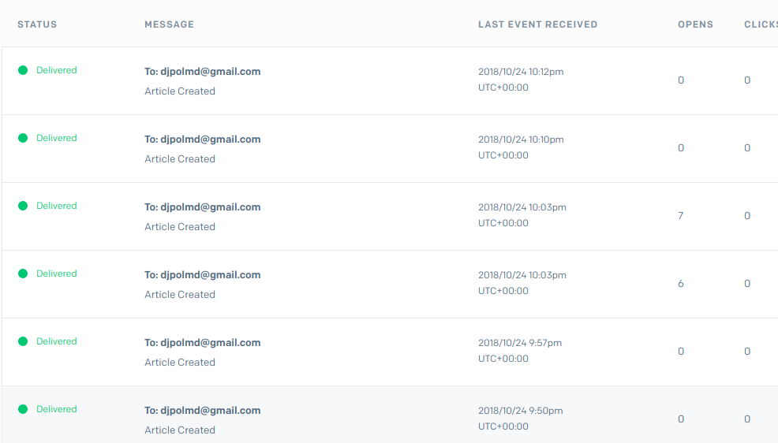

# laravel

#Table articles :
articol_id – identificator  
title – Titlu articolului  
description – Descriere articol.  
image – imaginea articolului 
text – Textul articolului 
send_to_admin_email – Indicator ca acest articol trebuie trimis pe email administratorului 
sent_to_admin_email – Indicator ca acest articol a fost trimis cu Jobs pe email administratorului. 
user_id – Article author 
created_at 
updated_at 
Fiecare articol il poate posta doar utilizatorii inregistrati. Deci folosim Auth service Laravel. 
 
#Routes: 
Adaugare articol: 
GET /articles/add 
Editare articol: 
GET /articles/edit/<articol_id> 
Salvare articol: 
POST /articles/save 
Modificare articol: 
PUT /articles/update/<articol_id> 
Vizualiare articole (lista):  cu toate detaliile fiecarui articol 
GET /articles 
Vizualizare articol cu toate detaliile articolului 
GET /articles/<articol_id> 
 
****La fiecare adaugare sau modificare a unui articol, daca checkbox este selectat pentru a notifica administratorul sa fie trimis pe email administatorului (administrator@site.com ) o notificare ca a fost adaugat sau salvat un articol + detalii despre articol + url catre articol cu JobsEvent(Queue).

<H3>Cind cream un articol email automat este livrat catre @ adresa setata in .env (pentru asta va trebui setat smpt server:local sau in cazul meu am folosit smpt sendgrid ca sa monotorizez statistica in test)  </H3>

